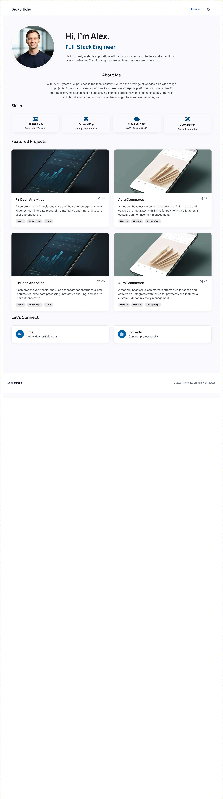

# Portfolio Project UI

[](https://flutter.dev)
[](https://dart.dev)
[](https://flutter.dev/multi-platform)

A modern, responsive portfolio application built with Flutter. Showcase your professional profile, skills, and projects with a beautifully designed UI that adapts seamlessly across all devices — from mobile phones to desktop screens.

## Preview

<!-- Add your screenshot/GIF here -->



## Features

- **Responsive Design** — Optimized layouts for mobile, tablet, and desktop devices
- **Modern UI System** — Custom design tokens with consistent colors and typography
- **Cross-Platform Support** — Deploy to iOS, Android, Web, Windows, macOS, and Linux
- **Custom Typography** — Manrope font family with multiple weights (200–800)
- **SVG Support** — Scalable vector graphics for crisp icons on any display
- **Modular Architecture** — Well-organized, maintainable code structure
- **Accessible Components** — Built with Material Design principles

### Sections

- **Header** — Navigation and branding
- **Info** — Profile introduction with job title
- **About Me** — Personal background and description
- **Skills** — Categorized skill display (Frontend, Backend, Cloud, UI/UX)
- **Featured Projects** — Project showcase with technology tags
- **Connect** — Social media and contact links
- **Footer** — Additional information and credits

## Tech Stack

| Category | Technology |
|----------|------------|
| **Framework** | Flutter SDK ^3.10.7 |
| **Language** | Dart 3.10.7+ |
| **Icons** | cupertino_icons ^1.0.8 |
| **SVG Support** | flutter_svg ^2.2.4 |
| **Code Quality** | flutter_lints ^6.0.0 |

## Prerequisites

Before running this project, ensure you have the following installed:

- [Flutter SDK](https://flutter.dev/docs/get-started/install) (3.10.7 or higher)
- [Dart SDK](https://dart.dev/get-dart) (included with Flutter)
- An IDE such as [VS Code](https://code.visualstudio.com/) or [Android Studio](https://developer.android.com/studio)
- For mobile development:
  - Android Studio and Xcode (for iOS development on macOS)
- For web development:
  - A modern web browser (Chrome, Firefox, Safari, Edge)

## Installation

1. **Clone the repository**
   ```bash
   git clone https://github.com/yourusername/portofolio_project_ui.git
   cd portofolio_project_ui
   ```

2. **Install dependencies**
   ```bash
   flutter pub get
   ```

3. **Run the application**
   ```bash
   # For a specific device
   flutter run

   # Or specify the target platform
   flutter run -d chrome      # Web
   flutter run -d macos       # macOS
   flutter run -d windows     # Windows
   flutter run -d android     # Android
   flutter run -d ios         # iOS
   ```

4. **Build for production**
   ```bash
   # APK for Android
   flutter build apk --release

   # App bundle for Android
   flutter build appbundle --release

   # IPA for iOS
   flutter build ios --release

   # Web
   flutter build web --release

   # Desktop
   flutter build macos --release
   flutter build windows --release
   flutter build linux --release
   ```

## Project Structure

```
lib/
├── core/                          # Design system & utilities
│   ├── app_colors.dart            # Color palette definitions
│   ├── app_text_style.dart        # Typography system
│   ├── responsive_text.dart       # Responsive text scaling
│   └── app_images.dart            # Generated image assets
├── models/                        # Data models
│   ├── project_model.dart         # Project data structure
│   └── skill_model.dart           # Skills data structure
├── layouts/                       # Responsive layouts
│   ├── layout_widget.dart         # Main responsive wrapper
│   ├── mobile_layout.dart         # Mobile-specific layout
│   ├── tablet_layout.dart         # Tablet-specific layout
│   └── desktop_layout.dart        # Desktop-specific layout
├── screens/                       # Application screens
│   └── portofolio_screen.dart     # Main portfolio screen
└── widgets/                       # Reusable components
    ├── header_section/            # Header widgets
    ├── about_me_section/          # About section widgets
    ├── info_section/              # Profile info widgets
    ├── projecs/                   # Project showcase widgets
    ├── skills/                    # Skills display widgets
    ├── connect_section/           # Contact/social widgets
    ├── footer_section/            # Footer widgets
    └── title_divider_component.dart

assets/
├── images/                        # Image assets
└── fonts/                         # Custom fonts (Manrope)
```

## Customization

### Personal Information

Update your personal details in the respective section widgets:

1. **Profile Info** — Modify `lib/widgets/info_section/`
2. **About Me** — Edit `lib/widgets/about_me_section/`
3. **Skills** — Update `lib/models/skill_model.dart`
4. **Projects** — Modify `lib/models/project_model.dart`

### Colors

Customize the color scheme in [lib/core/app_colors.dart](lib/core/app_colors.dart):

```dart
static const Color primaryColor = Color(0xFF0F172A);
static const Color secondaryColor = Color(0xFF414750);
// Modify as needed
```

### Typography

The project uses the **Manrope** font family. To change fonts:

1. Add your font files to `assets/fonts/`
2. Update `pubspec.yaml` under the `fonts` section
3. Modify text styles in [lib/core/app_text_style.dart](lib/core/app_text_style.dart)

### Images and Assets

Replace placeholder images in `assets/images/`:
- `profile.png` — Your profile picture
- `project1.png`, `project2.png` — Project screenshots
- SVG icons for skills and UI elements


## Contributing

Contributions are welcome! If you'd like to contribute:

1. Fork the repository
2. Create a feature branch (`git checkout -b feature/amazing-feature`)
3. Commit your changes (`git commit -m 'Add some amazing feature'`)
4. Push to the branch (`git push origin feature/amazing-feature`)
5. Open a Pull Request

Please ensure your code follows the project's coding standards and passes all lint checks.


## Acknowledgments

- Built with [Flutter](https://flutter.dev)
- Typography by [Manrope](https://fonts.google.com/specimen/Manrope)
- Icons by [Cupertino Icons](https://pub.dev/packages/cupertino_icons)

---

Made with Flutter by [Ammar Ageeza](https://www.linkedin.com/in/ammar-ageeza/)
